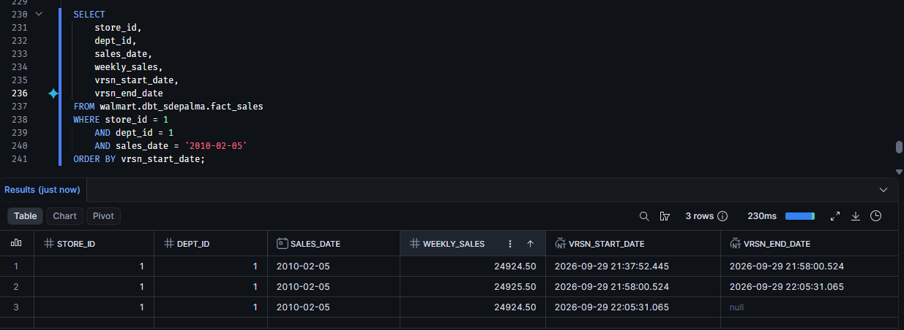

# Modeling and Validation

## Data Model

The date dimension stores one row per date, with a numeric date key, holiday flag, and insertion/update timestamps. Type 1 upserts refresh the existing row without keeping older versions. The insertion timestamp remains unchanged, while the update timestamp reflects the latest processing run.

The store dimension stores one row per store–department combination found in the sales data. Each combination is joined to the store’s type and size. It uses the same Type 1 upsert behavior as the date dimension.

The sales history snapshot combines weekly sales with store size and weekly economic and environmental conditions. On each run, dbt checks whether the tracked values have changed. If they have, it retains the previous row with a version end timestamp and inserts a new version with a NULL end timestamp.

The fact table, `fact_sales`, presents all snapshot versions with their sales measures, version start/end dates, and insertion/update timestamps. The analytical table, `obt_walmart_sales`, selects only current versions and joins the date and store dimensions, producing a flat dataset for downstream analysis.

## Type 2 History Validation

A controlled test tracked sales for store 1, department 1, and the week dated 2010-02-05.

| Stage | Weekly Sales | Observed Behavior |
|---|---:|---|
| Initial capture | 24,924.50 | Original version recorded |
| Controlled change | 24,925.50 | Original version closed; new current version inserted |
| Restoration | 24,924.50 | Test version closed; restored value inserted as a third version |
| Unchanged rerun | 24,924.50 | Three versions retained, with exactly one current version |

Each closed version’s end timestamp matched the next version’s start timestamp. The current version had a NULL end date.

## Serving Table Validation

Duplicate-key checks confirmed uniqueness at the store–department grain in the store dimension and the store–department–week grain in the analytical table. After restoring the original sales value and rerunning the snapshot and downstream models, the analytical table contained exactly one row for the tested combination, with weekly sales of 24,924.50.

The verification queries are retained in [02_verify_results.sql](../sql/02_verify_results.sql).